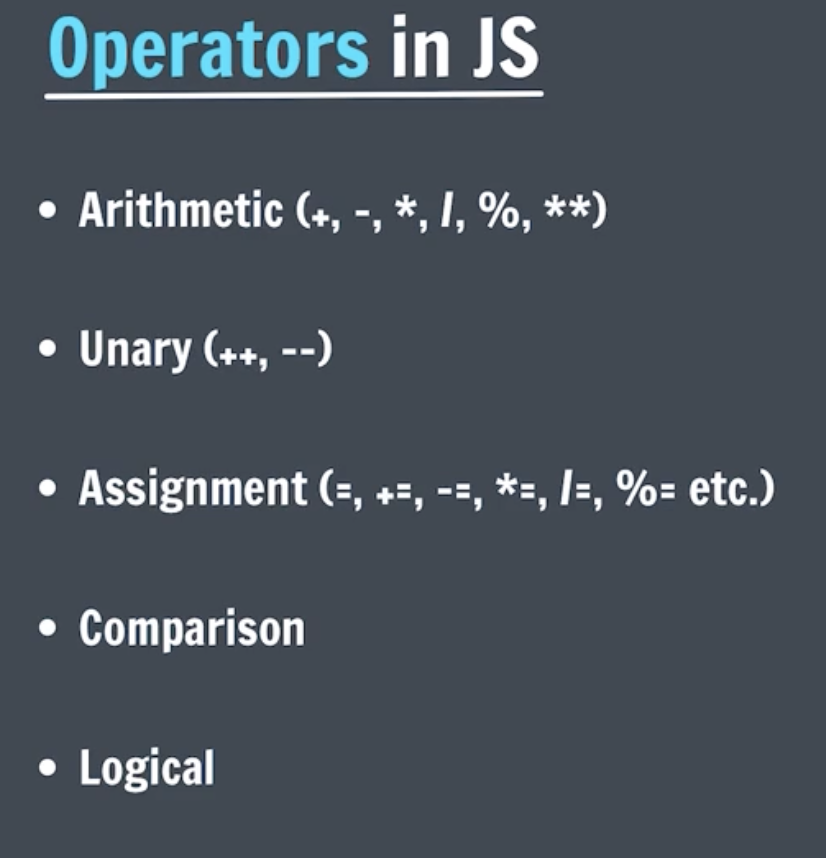

# Link Js

` `

# Tamplet Literals

` (`the sum is : ${price}`) `

# Operators

# Comparison for non-numbers

# Comparison Operator

# Conditional Statement.

- if-else
- nested if-else
- switch

# truthy & falsy

