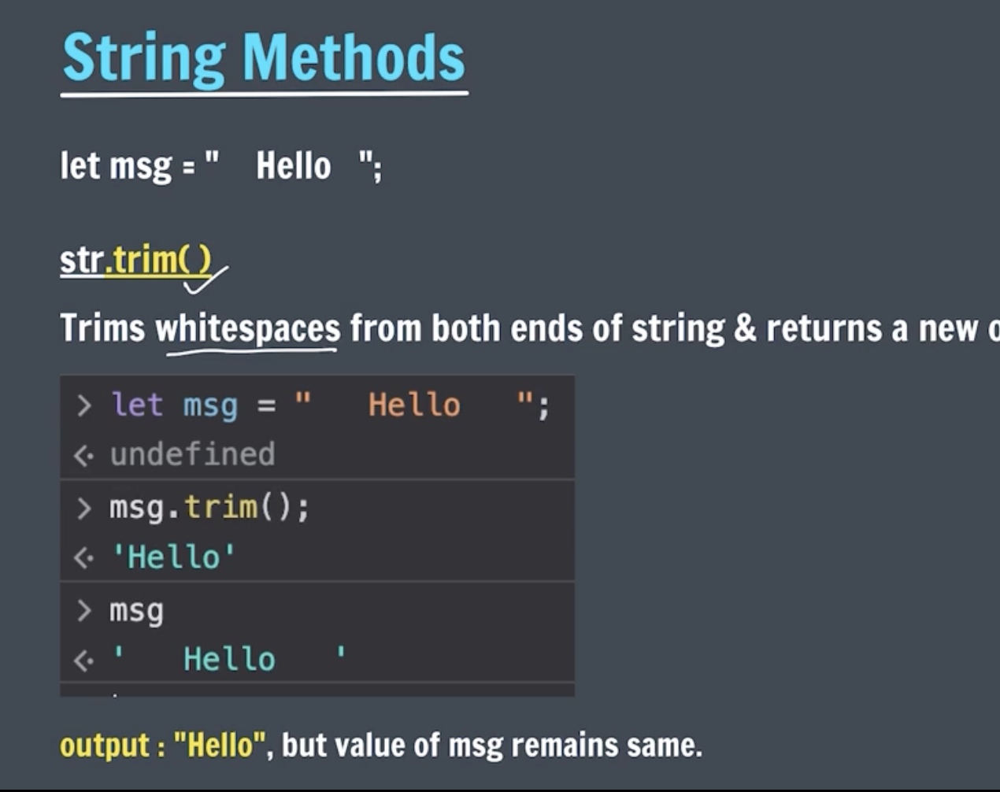

# String Method

### Format

`String.method()`

## 1. trim

This is use for remove space of start and end string

# Upper and Lower Case

# WE can use Multiple Method in string

`String.trim().toUpperCase()`

# indexoff()

The `indexOf()` method of `Array` instances returns the first index at which a given element can be found in the array, or -1 if it is not present.

# slice

`str.slice(start,end)`

# replace

its replace old string to new string which we gaven.
`str.replace('old','new')`

# repete

`str.repet(3)`

### --------------------------------------------------------

# Array

Array is mutable
