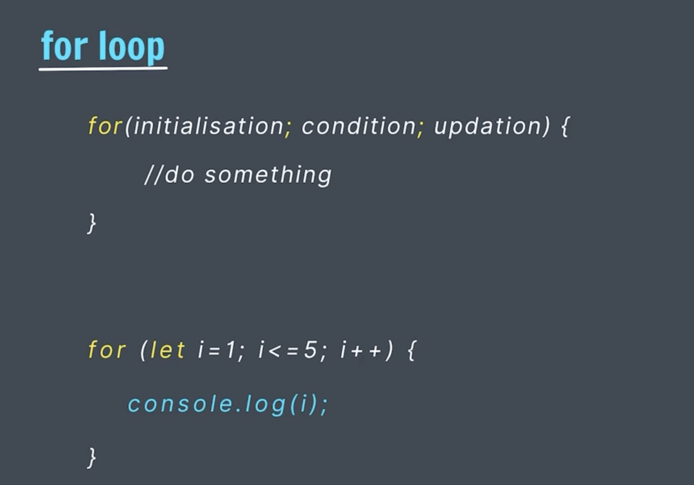

# Loops

## For Loop



# Nested for loop


## While Loop

```
const favMovie = "Thor";
let guess = prompt("Guess the my Fav movie..");
while ((guess != favMovie) && (guess != "quit")){
    guess = prompt("Wrong Guess. Please try again later.")
}
```

## break in Loop

```
let i = 1;
while(i <= 5){
    if (i === 3){
        break;
    };
    console.log(i);
    i++;
}
console.log(`we use break at 3`);
```
